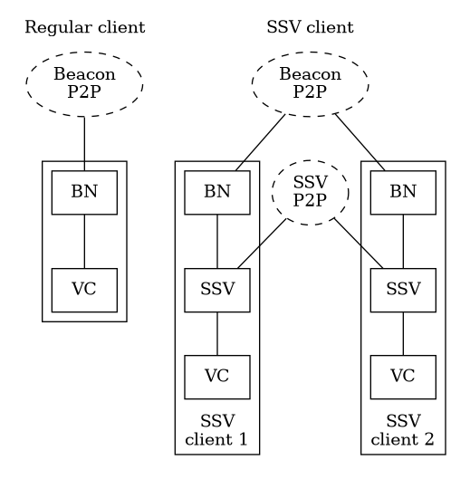

# python-ssv
Proof of concept of an Eth2 secret shared validator node

# Requirements

 * Python 3.8. Use `venv.sh` to create a virtualenv with the required packages.
 * `python-ibft`: https://github.com/dankrad/python-ibft
 * Prysm beacon node and validator client, adapted for SSV node: `https://github.com/alonmuroch/ethereumapis/tree/feature/ssv`
 * `tmux` for demo scripts

# Usage

 * You can split a validator private key into the threshold keys using `privkey_to_threshold.py`.
 * Then use `run.sh` to run all the SSV nodes in one tmux window
 * `run_validators.sh` needs to be copied into the `validator` directory of the prysm SSV node. Running it will launch the 4 VCs to connect to the SSV nodes in a tmux window

# How it works

In a regular client, the validator client gets its duties from the beacon node, performs the necessary computations, and then sends the signed information back to the BN.

This SSV client adds an intermediate module which coordinates with the other that share the same secret. When the SSV module receives a task from the BN (say, attesting for a slot), it follows this process:
1. Comes to a consensus with the rest of the instances on what to sign.
2. Then sends the task to the VC to sign the result with its threshold key.
3. Broadcasts the signed result to the other nodes and waits to receive T signatures.
4. Reconstructs the aggregate signature and sends the result to the BN.

# Issues

1. IBFT instances do not check the validity of decided values!! A single faulty leader can
get signatures for arbitrary data.
Solution: use the validity callback to check that the attestation data is correct
What happens if different instances see different parent blocks? (eg due to beacon chain latency)

2. No testing without testnet :(

3. How does the BLS threshold interact with the IBFT 1/3 minimum consensus? Since IBFT assumes <1/3 faulty replicas, does this constrain T?
Imagine T > 2N/3. IBFT comes to a consensus with 2/3 quorum, but this is not enough to reconstruct signature.
